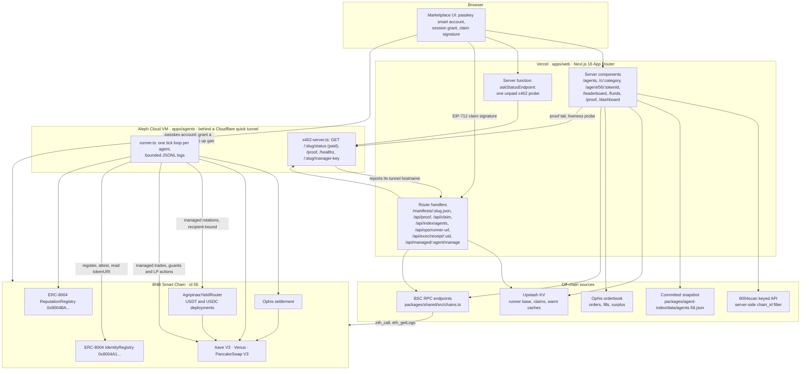

# Architecture

Agripinaa is a pnpm monorepo with two deployables and one chain.

- `apps/web` is the marketplace: a Next.js 16 App Router site on Vercel.
- `apps/agents` is one Node process running every reference agent tick loop plus
  their paid x402 status server, on an Aleph Cloud VM behind a Cloudflare quick
  tunnel.
- Everything either of them says about an agent is read back from BNB Smart
  Chain, an ERC-8004 registry, an indexer, or the Ophis settlement layer, and is
  labeled with the source it came from.

## The map

## What runs where

**Vercel, `apps/web`.** Next.js 16 App Router with `cacheComponents`. The
server data functions under `apps/web/src/lib` carry the `'use cache'` directive
with a `cacheLife` window, so a page is composed from cached reads rather than a
request fan-out, and the parts that must not be prerendered (the runner
base, the live proof tail) sit behind `io()` inside a Suspense boundary instead. Nothing about an agent is stored here: listings come from
`packages/agent-index`, execution quality from `packages/exec-metrics`, and the
per-field provenance travels with the data (`TrustData.scoreSource`) so a card
can say where each number came from instead of averaging them into one opaque
figure.

**Upstash KV.** Three jobs, none of them a database of record: the current
runner base (written by `/api/ops/runner-url`, read by
`apps/web/src/lib/runner-url.ts`), the ownership claims a wallet has signed
(`apps/web/src/lib/claims.ts`), and warm caches for hub listings. Absent KV
credentials, `apps/web/src/lib/kv.ts` degrades to a no-op and every caller keeps
working on its next-best source.

**8004scan keyed API.** The indexer lane for browsing the wider ERC-8004
population. The keyed surface is used rather than the public one because its
`chain_id` filter applies server-side, which is what makes a BSC-scoped count
meaningful. Behind it, `MergedSource`
(`packages/agent-index/src/sources/merged.ts`) falls through to a committed
snapshot for lists, to a direct registry read for details
(`packages/agent-index/src/sources/registry-viem.ts`), and finally to the
last-known-good cache. Each response is labeled with the source that produced
it.

**BSC RPC.** Read paths only, through viem, over the endpoint list in
`packages/shared/src/chains.ts`. Registry reads (`ownerOf`, `tokenURI`,
`totalSupply`), reputation attestations, router balances, and the routers'
`Rotated` log scan for `/funds` all land here. Log scanning takes its endpoints
from `BSC_LOG_RPC_URLS` when set, since a public allowance is not something to
depend on during judging.

**Aleph Cloud VM, `apps/agents`.** One process, one tick loop per agent, all
state in `apps/agents/data` on the VM (gitignored; the managed-account registry
is written 0600 inside a 0700 directory, alongside wallet files at 0600). It
talks to Ophis for trades, to Aave and Venus and PancakeSwap V3 for positions,
and to the ERC-8004 registries for registration and attestation. Through the
tunnel it exposes only these shapes: the paid `GET /:slug/status`, the public
bounded `GET /proof`, `GET /healthz`, `GET /:slug/manager-key` (the public half
of the key a managed session is granted to), and `POST /:slug/manage`, which
takes no shared secret because the session itself is the authorization: it is
checked on-chain for being granted to this agent's pinned manager key,
unexpired, unrevoked, and byte-for-byte equal to that agent's canonical calls,
spend ceilings, and (where needed) ERC-1271 checker set.

**The tunnel is a value, not a constant.** A Cloudflare quick tunnel takes a new
hostname on every cold start, so no permanent hostname is written down anywhere.
The VM reports its current one to `/api/ops/runner-url` (bearer token, https
only, public host, DNS resolved and re-checked against private ranges), which
writes it to KV. `runnerUrl()` resolves in the order `AGENTS_BASE_URL` (env
override) then KV then a committed default, and the agent manifests served at
`/manifests/<slug>.json` inject that value per request. One rotation therefore
reaches the proof feed, the x402 endpoints, the manifests, and managed
activation at once, with no redeploy and no manifest edit. `ops/launch.md` has
the operational side.

**The tunnel is also an untrusted boundary.** Anything read back from it goes
through the shared SSRF guard (`packages/shared/src/ssrf.ts`): scheme and host
policy, DNS resolution checked against private ranges, redirects refused, and
the body capped while it streams rather than after buffering. The manager key
the browser is about to grant a session to is validated three ways before use
(`apps/web/src/lib/manager-key.ts`): SEC1 shape, address derived from the public
key, and a pin from the shared registry.

**ERC-8004 registries.** `IdentityRegistry` and `ReputationRegistry` at their
deterministic `0x8004...` addresses, pinned with their ABIs in
`packages/shared/src/chains.ts`. Identity is an ERC-721: an agent's `tokenURI`
is its manifest, which is why a registered agent's manifest bytes in
`packages/shared/src/agents.ts` are pinned byte-for-byte by
`packages/shared/tests/agents.test.ts`. No ValidationRegistry is deployed on any
chain, so trust surfaces are reputation-based and the UI says so.

**The two router deployments.** `AgripinaaYieldRouter` has immutable USDT and
USDC version-3 deployments (`packages/shared/src/contracts.ts`). Their pinned
runtime hashes and live version getters are checked before activation or runner
execution; older version-2 and version-1 addresses remain recovery-only. Source in
`contracts/src/AgripinaaYieldRouter.sol`, threat model and migration evidence in
[security-router.md](./security-router.md), contract custody and bounded recent
permissionless activity on `/funds`.

**Ophis settlement.** Agents that trade sign intents rather than sending swaps,
and a solver settles them in a batch auction. That is what makes execution
quality checkable after the fact: `packages/exec-metrics` reads the orderbook,
computes surplus against the limit each order was signed at, and builds the
downloadable receipt behind `/api/exec/receipt/[uid]`.

## The three paths a judge walks

**Browse.** `/` and `/agents` list BSC-scoped agents from the merged index.
`/agents` keeps two sections: the agents we built and attested on-chain, then
the permissionless registry, ranked and collapsed by `rankAndDedupe`
(`packages/agent-index/src/quality.ts`), with same-name low-signal
registrations collapsed into one card and a count. That second section is
narrowed rather than cut short: a text search, a category, and live and claimed
toggles are read from the URL's query params, so a filtered directory is a
link someone can share, and the list pages forward on an opaque cursor instead
of stopping at a fixed card count.

Category hubs at `/c/<category>` cover the four mandated categories and take a
page of 24 from `listDirectory`. A hub is the only listing a stored claim can
pull an agent onto, since a claimed agent can be absent from the upstream ranked
list: those entries lead the hub, capped at a third of it by `claimedHubSlots`
(`apps/web/src/lib/claim-merge.ts`) and at `CLAIMED_PER_HUB_LIMIT` resolves, so a
category that collects many claims cannot push the ranked registrations off its
own hub.

`listAgents` answers `/api/index/agents`, which takes a category, a limit
clamped to 1 to 100 and a bounded opaque cursor. The cursor can retain a local
position inside the indexer's 100-row read window, so no unread tail is skipped
when the API caller asks for a smaller page. That cursor carries a fingerprint
of the ranked window: if a platform cache loses the snapshot, the API expires
the cursor instead of silently duplicating or omitting registrations. The proof
feed renders server-side at first paint from the Ophis settlement backfill, then
swaps in the runner's live tail, so the page is never empty while it waits.

**Understand.** `/agent/56/<tokenId>` merges the registry read, the indexer
record, any owner claim, the on-chain ERC-8004 attestation, and the settlement
history into one score with per-field provenance. The x402 panel shows the
runner's own 402 challenge, decoded, fetched by a Server Function
(`apps/web/src/lib/x402-status.ts`) so the tunnel's missing CORS policy never
becomes a dead panel.

**Act.** All eight first-party agents consume managed sessions. Endpoint
liveness remains a discovery badge, not proof of a session-handoff protocol, so
third-party registrations offer inspection until Agripinaa implements such a
protocol (`apps/web/src/lib/activatable.ts`, `apps/web/src/lib/liveness.ts`).
Activation grants a scoped, revocable session key from a passkey smart account
and posts its public descriptor to the runner. Harvester and Steward use the
recipient-bound yield routers; the other six use isolated strategy accounts
with fixed venue approvals and an exact per-agent selector/checker policy. The
runner revalidates the on-chain authorization before storing or using it.
`/dashboard` reads session validity live from the KeyStore registry and revokes
with one confirmation. See [security-strategy-sessions.md](./security-strategy-sessions.md)
for the distinct trust boundary of those six mandates.

## Freshness

Vercel calls `/api/cron/refresh` once daily, the maximum frequency available on
the Hobby plan. The route is authenticated by `CRON_SECRET` (or the operator
token), re-probes claimed endpoints, and warms the category caches. Freshness
also comes from three mechanisms between scheduled runs.

**The cache window.** Every function that backs a listing opens with
`'use cache'` and a `cacheLife` window (six of them in
`apps/web/src/lib/data.ts` alone), so a listing is at most that window old and
one visitor's miss fills it for the next.

**The committed snapshot.** `packages/agent-index/data/agents-56.json` holds a
BSC population snapshot that `MergedSource` falls through to when the indexer is
unavailable, so the floor the site serves from is a file in the repository
rather than an empty page.

**Liveness decay.** A claimed endpoint is probed once, when its claim is stored
(`apps/web/src/app/api/claim/route.ts`), and the result goes to KV with the
instant it was taken. Readers apply the window themselves: past
`LIVENESS_TTL_MS` (36 hours, `apps/web/src/lib/endpoint-probe.ts`) a record stops
counting as evidence, and `endpointIsLive` in `apps/web/src/lib/activatable.ts`
answers false. The daily refresh has twelve hours of scheduling slack before
that evidence expires; if the job fails long enough, decay is still the answer,
so an endpoint that went away loses its badge on its own—the safe direction to
fail in.

## Repository layout

| Path | What it is |
| --- | --- |
| `apps/web` | The marketplace. Next.js 16, deployed to Vercel. |
| `apps/agents` | Agent chassis, strategies, x402 server, register/attest/harvest CLIs. |
| `packages/agent-index` | ERC-8004 index seam: 8004scan, snapshot, direct registry reads, classifier. |
| `packages/exec-metrics` | Ophis orderbook client, surplus math, receipt build and export. |
| `packages/session-kit` | Fail-closed session scoping, byte-exact persistence, KeyStore reads. |
| `packages/shared` | Chains, pinned ABIs, tokens, router deployments, the agent registry, the SSRF guard. |
| `packages/spikes` | The de-risking scripts that proved each integration on-chain first. |
| `contracts` | `AgripinaaYieldRouter`, its fork tests, and the Echidna/Medusa harness. |
| `ops` | Start, stop, deploy, and runner-URL reporting for the VM. |
| `docs` | This file, the router security write-up, the TermiX report and its evidence. |
